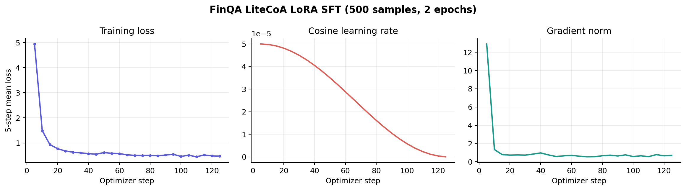

# 金融投研并行检索 Agent：Phase 0-3 完整报告

## 1. 报告范围与阶段定义

本报告按实际完成顺序整理金融迁移的前四个阶段：

| 阶段 | 内容 | 状态 |
| --- | --- | --- |
| Phase 0 | 环境、代码与初始模型准备 | 完成 |
| Phase 1 | FinQA 问题数据与无泄漏金融语料构建 | 完成 |
| Phase 2 | E5 + FAISS 检索器、报告范围检索与零样本基线 | 完成 |
| Phase 3 | teacher + 真实 retriever 数据构造、LoRA SFT 与全量评测 | 完成 |

旧计划曾将“零样本 smoke”单列为 Phase 3、将 SFT 写为 Phase 4。本报告以实际实验链路为准重新编号；后续 GRPO 统一称为 Phase 4，详见 `finance_phase4_grpo_report.md`。

最终保留的核心交互形式为：

```text
<think>检索与计算思路</think>
<search>query_1 || query_2</search>
<information>真实 retriever 返回的证据</information>
<think>基于证据完成计算或归纳</think>
<answer>短答案</answer>
```

`<information>` 永远由环境回填，不由 teacher 或被训练模型生成。

---

## 2. Phase 0：环境、代码与初始模型

### 2.1 目标

复用已经具备双 query 并行搜索能力的 Qwen2.5-3B Agent，将其从通用开放域问答迁移到金融年报数值问答，同时保持原有 rollout、真实检索和短答案链路。

### 2.2 基础资产

- 初始模型：`models/parallel_search_qwen25_3b_step900`。
- 模型规模：Qwen2.5-3B。
- 金融开发分支：`finance-agent`。
- 训练框架分工：
  - SFT：LLaMA-Factory + PEFT LoRA。
  - 推理与全量评测：vLLM。
  - 后续强化学习：veRL + GRPO。
  - 检索：E5 dense encoder + FAISS + HTTP `/retrieve`。

### 2.3 前置验收

- 模型可在 GPU 上正常加载并生成。
- `/retrieve` 可接收批量 query 并返回真实文档。
- rollout 能识别 `<search>q1 || q2</search>`，对 query 去重后并行检索，再按 query 分块回填 `<information>`。
- 原模型在金融数据上能够稳定完成 action 格式，但金融答案准确率低，因此需要领域数据和 SFT。

---

## 3. Phase 1：FinQA 数据与无泄漏语料构建

### 3.1 数据来源与划分

采用官方 FinQA 数据集及其原始 train/dev/test 划分。处理入口为：

```text
scripts/data_process/prepare_finqa.py
```

| Split | 问题数 | 独立报告数 |
| --- | ---: | ---: |
| train | 6,251 | 2,110 |
| dev | 883 | 299 |
| test | 1,147 | 380 |

三组报告文件名交集均为 0，训练、验证和测试报告不会跨 split 泄漏。

### 3.2 QA 监督数据

每条处理后的问题记录包含：

```json
{
  "id": "sample id",
  "split": "train",
  "report_id": "CDNS/2012/page_31.pdf",
  "question": "...",
  "gold_answer": "...",
  "executable_answer": "...",
  "program": ["..."],
  "gold_evidence": [
    {"source_id": "...", "text": "..."}
  ]
}
```

其中 `report_id` 保留到 page 级，例如 `CDNS/2012/page_31.pdf`。后续报告范围检索必须使用这个完整 ID；粗粒度的 `CDNS/2012` 不在索引映射中。

### 3.3 检索语料如何构造

语料只来自年报自身内容：

- `pre_text` 与 `post_text`：最多 5 行合并为一个 chunk，最长 1,200 字符。
- `table`：表头与每一数据行序列化为一个独立 chunk，格式为 `列名: 数值 | 列名: 数值`。
- 每个 chunk 保留 `report_id`、split、文本/表格类型、位置和标题。

明确排除以下监督字段：

- 标准答案；
- 可执行答案；
- gold program；
- gold evidence 标注。

因此检索器只能在原始财报文本与表格中找证据，不能直接检索到答案标签或计算程序。

### 3.4 语料规模

| Split | 文本 chunks | 表格 chunks | 总 chunks |
| --- | ---: | ---: | ---: |
| train | 11,428 | 11,601 | 23,029 |
| dev | 1,592 | 1,602 | 3,194 |
| test | 2,049 | 2,168 | 4,217 |
| 合计 | 15,069 | 15,371 | 30,440 |

### 3.5 数据质量验收

使用 gold evidence 对构造后的 corpus 做词面覆盖审计：

| Split | 平均 gold-evidence token 覆盖率 | 完整覆盖样本 |
| --- | ---: | ---: |
| train | 99.27% | 5,440 / 6,251（87.03%） |
| dev | 99.33% | 761 / 883（86.18%） |
| test | 99.20% | 975 / 1,147（85.00%） |

该指标验证的是“正确证据是否被语料构造保留下来”，不是实际 retriever 的 Top-K 命中率。

---

## 4. Phase 2：金融检索器与零样本基线

### 4.1 检索器实现

- 编码模型：`intfloat/e5-base-v2`。
- 向量索引：FAISS Flat dense index。
- 服务接口：`POST http://127.0.0.1:8000/retrieve`。
- 结果格式：每个 query 返回 Top-K 文档及分数，rollout 再组织为 `[Query] ... / Doc 1 ...`。

### 4.2 报告范围检索

最初的全局检索会在 30,440 个 chunk 中竞争，容易召回其他公司或年份的同名指标。随后加入 report-aware retrieval：

```json
{
  "queries": ["query 1", "query 2"],
  "report_ids": [
    "CDNS/2012/page_31.pdf",
    "CDNS/2012/page_31.pdf"
  ],
  "topk": 3,
  "return_scores": true
}
```

每个 query 都绑定当前问题的完整 page-level `report_id`，只在同一报告范围内检索。这既减少跨报告干扰，也保证 teacher 数据构造和评测使用同一条检索链路。

### 4.3 检索 smoke

对 50 条 dev 问题直接检索，Top-3 结果为：

- 任一 gold evidence 命中率：54.0%。
- gold evidence 平均召回率：35.79%。

错误分析表明，FinQA 计算题经常需要分子与分母、两个年份或两个指标。模型若生成两个同义 query，即使查询流畅，也可能只召回一侧变量。这成为 SFT 数据中“互补双 query”的主要设计依据。

### 4.4 原始模型零样本结果

先用 50 条全局检索 smoke 验证行为链路：

- 50/50 成功生成答案；
- 50/50 为单轮双 query 搜索；
- 无伪造 `<information>`，无最大轮次超限；
- 49 条有效 gold 中，EM 2/49（4.08%），SubEM 6/49（12.24%）。

之后使用 report-aware retrieval 在完整 FinQA dev 上评测原始 step900 模型：

| 指标 | 结果 |
| --- | ---: |
| 总样本 | 883 |
| 有有效 gold 的样本 | 871 |
| Numeric EM | 103 / 871 = 11.83% |
| Raw exact EM | 75 / 871 = 8.61% |
| SubEM | 120 / 871 = 13.78% |
| 生成 answer | 881 / 883 |
| Runtime errors | 0 |
| 伪造 information | 0 |
| Max-turn exceeded | 0 |

结论：原模型的并行搜索格式可以直接迁移，但不熟悉财报术语、表格变量定位和金融数值表达，必须进行领域 SFT。

---

## 5. Phase 3：金融 SFT 数据构造

### 5.1 构造目标

构造 500 条高质量轨迹，让模型学习：

1. 从金融问题中识别所需变量；
2. 一次生成两个互补 query，例如分子与分母、当前年份与对照年份；
3. 只使用真实 retriever 返回的财报证据；
4. 基于证据给出简短数值答案。

### 5.2 Teacher 与 retriever 分工

- Teacher：`deepseek-v4-pro`。
- Retriever：本项目 E5 + FAISS `/retrieve`，Top-3，绑定当前 `report_id`。
- Teacher 只允许生成 `<think>`、`<search>` 与 `<answer>`。
- `<information>` 由 Python 调用真实 retriever 后插入，teacher 无权编写。
- 最多 2 轮搜索，每轮最多 2 个 query。

首轮 teacher 被要求只输出：

```text
<think>识别问题需要的金融量</think>
<search>互补 query 1 || 互补 query 2</search>
```

检索完成后，teacher 看到问题、已有轨迹和真实 evidence。证据充分时输出 `<think><answer>`；不足时再生成一轮 `<search>`。

### 5.3 20 条闭环验证

正式扩量前先跑严格 20 条闭环：

| 项目 | 结果 |
| --- | ---: |
| Accepted | 20 |
| Rejected | 40 |
| 运行时间 | 1,092.85 秒，约 18.2 分钟 |
| Answer match | 必须通过 |
| Gold evidence hit | 必须通过 |
| Strict format | 开启 |

20 条闭环证明 teacher API、报告范围检索、真实 information 回填、答案过滤和落盘格式均可运行。

### 5.4 500 条并行构造

正式构造拆成 4 个 worker，每个 worker 接受 125 条，最后按样本 ID 去重合并：

| Worker | Accepted | Rejected | 耗时 |
| --- | ---: | ---: | ---: |
| 0 | 125 | 250 | 6,514.68 秒 |
| 1 | 125 | 192 | 5,283.71 秒 |
| 2 | 125 | 200 | 5,268.99 秒 |
| 3 | 125 | 184 | 5,165.84 秒 |
| 合计 | 500 | 826 | 并行墙钟约 1 小时 48 分 |

共处理 1,326 个候选，最终接受率约 37.7%，得到恰好 500 条唯一记录。

Accepted 轨迹的搜索分布：

- 475 条：1 轮搜索，共 2 个 query；
- 4 条：2 轮搜索，共 3 个 query；
- 21 条：2 轮搜索，共 4 个 query；
- 单 query accepted 样本：0。

### 5.5 过滤规则

以下任一情况会被拒绝：

- 缺失 `<think>` 或 `<search>`；
- query 为空、重复、仍是 `query1/query2` 占位符，或包含 XML tag；
- 每轮 query 数超过限制；
- teacher 自行生成 `<information>`；
- 达到最大轮次仍没有 `<answer>`；
- answer 过长或轨迹包含结构警告；
- answer 与 gold answer 的 EM/SubEM 均不匹配；
- 真实检索内容没有覆盖足够 gold evidence。

gold evidence 过滤不是简单检查答案字符串，而是对每段实质性 gold evidence 做 token overlap：至少 3 个 token，覆盖率达到 80% 才算命中；一条样本最多要求命中 2 段实质证据。

### 5.6 原始记录与训练记录的区别

数据构造脚本先保存便于审计的三消息记录：

```text
system: teacher 构造规则
user: 问题与首轮构造要求
assistant: 完整 think/search/information/think/answer 轨迹
```

该格式不会直接送进 SFT。转换脚本
`scripts/data_process/convert_litecoa_sft_for_llamafactory.py`
将其改为 LLaMA-Factory 可消费的多轮 ShareGPT messages：

```json
{
  "messages": [
    {"role": "user", "content": "统一推理 prompt + Question"},
    {"role": "assistant", "content": "<think>...</think>\n<search>q1 || q2</search>"},
    {"role": "user", "content": "<information>真实检索结果</information>"},
    {"role": "assistant", "content": "<think>...</think>\n<answer>...</answer>"}
  ]
}
```

这样做有两个关键作用：

- `<information>` 作为环境侧 user observation，不计入 assistant 训练 loss；
- 模型学习的是“看到真实 evidence 后继续回答”，而不是学习伪造 evidence。

#### 历史 prompt 不一致

本次 500 条数据的实际 LLaMA-Factory user prompt 仍沿用了通用 LiteCoA
模板，其中包含 `Use <plan> to decompose...`；但 Finance teacher 的监督 target
从未输出 `<plan>`。也就是说，训练输入要求 plan，而训练标签实际教模型直接
`<think> -> <search>`。这解释了 SFT 评测中 `has_plan=0`，也说明该结果应被
理解为 no-plan 金融并行搜索冷启动，而不是成功学习 plan-first 格式。

真实的转换前后样本已归档：

- [`sft_raw_example.json`](./finqa_eval/20260727/phase3_sft/sft_raw_example.json)
- [`sft_llamafactory_example.json`](./finqa_eval/20260727/phase3_sft/sft_llamafactory_example.json)

转换脚本现已新增 `--prompt_style finance_no_plan`。后续重新构造金融数据时应
显式使用该模式，使 SFT、GRPO 和推理 prompt 一致；原 `litecoa_plan` 默认值
继续服务旧 NQ 数据，避免改变历史实验。

最终训练集：

```text
data/finance_finqa/sft/finqa_litecoa_500/finqa_litecoa_sft_500.jsonl
```

数据注册为 `sharegpt`，角色字段为 `role/content`。本次历史数据的 metadata
存在默认 `source=nq`，但 LLaMA-Factory 只读取 `messages`，不影响训练。
`build_finqa_sft.py` 的默认值现已修正为 `source=finqa`，后续数据不再继承该错误。

---

## 6. Phase 3：LoRA SFT 训练

### 6.1 使用框架

- LLaMA-Factory：训练入口和数据模板管理；
- PEFT LoRA：参数高效微调；
- PyTorch DDP：2 个训练进程；
- BF16 + gradient checkpointing：降低显存占用；
- W&B：训练过程监控；
- vLLM：训练后带 retriever 的全量 rollout 评测。

### 6.2 正式配置

| 配置 | 数值 |
| --- | --- |
| Base model | `parallel_search_qwen25_3b_step900` |
| Dataset | FinQA LiteCoA 500 |
| Template | `qwen` |
| LoRA target | `all`，实际为 q/k/v/o 与 gate/up/down projection |
| LoRA rank / alpha | 64 / 128 |
| LoRA dropout | 0.05 |
| Cutoff length | 4,096 tokens |
| Per-device batch | 1 |
| Gradient accumulation | 4 |
| DDP world size | 2 |
| Effective batch | 1 x 4 x 2 = 8 |
| Epochs | 2 |
| Optimizer steps | 126 |
| Learning rate | 5e-5 |
| Scheduler | cosine |
| Warmup ratio | 0.03 |
| Precision | BF16 |
| Train on prompt | false |
| Validation in Trainer | 无，训练后单独做 Agent rollout eval |

可训练参数为 119,734,272 / 3,205,672,960，约占 3.7351%。

本次 SFT 环境版本已从训练服务器核对：

| 组件 | 版本 |
| --- | --- |
| Python | 3.11.15 |
| PyTorch | 2.11.0+cu130 |
| Transformers | 5.6.0 |
| PEFT | 0.18.1 |
| Datasets | 4.0.0 |
| Accelerate | 1.11.0 |
| W&B | 0.28.0 |

Transformers 5.6 与 GRPO 环境中的旧 Transformers 配置格式差异，正是后续
RoPE 合并漂移需要单独修复的原因，因此版本信息属于模型产物的一部分。

### 6.3 Smoke 与正式训练

训练前先用 8 条样本跑 4-step smoke：rank 32、alpha 64、1 epoch。smoke 用于验证数据读取、mask、反向传播、checkpoint 和 W&B 链路，不用于判断模型效果。

正式训练结果：

| 指标 | 结果 |
| --- | ---: |
| 样本数 | 500 |
| Epochs | 2 |
| Optimizer steps | 126 |
| Runtime | 237.95 秒，约 3 分 58 秒 |
| Samples/s | 4.203 |
| Steps/s | 0.530 |
| Trainer 全程平均 loss | 0.7749 |

loss 从 step 5 的 4.9403 快速下降到：

- step 25：0.6808；
- step 65：0.5274；
- step 100：0.4638；
- step 125：0.4768。

`train_loss=0.7749` 是包含最初高 loss 区间的全程均值，不是最后一个窗口的 loss。



原始 LLaMA-Factory loss 图、trainer state、数据合并报告和训练结果均归档于：

```text
docs/finqa_eval/20260727/phase3_sft/
```

用户提供的 W&B run `dqzvmyqm` 经核对属于此前通用 LiteCoA SFT：250 steps、约 510 秒、最终训练均值 loss 0.8226，不是本次 FinQA 500 条 SFT。它可作为框架运行参考，但本报告曲线使用 FinQA 本次训练的 `trainer_state.json`，避免混用实验。

### 6.4 关键复现命令

以下命令固定数据转换与 SFT 入口；路径可按服务器调整：

```bash
# FinQA 原始数据 -> QA JSONL 与无泄漏 corpus
python scripts/data_process/prepare_finqa.py \
  --raw_dir data/finance_finqa/raw/FinQA/dataset \
  --output_dir data/finance_finqa/processed

# teacher 原始轨迹 -> no-plan ShareGPT messages
python scripts/data_process/convert_litecoa_sft_for_llamafactory.py \
  --input data/finance_finqa/sft/finqa_sft_500_parallel/finqa_sft_500.jsonl \
  --output data/finance_finqa/sft/finqa_litecoa_500/finqa_litecoa_sft_500.jsonl \
  --keep_metadata \
  --max_queries_per_turn 2 \
  --prompt_style finance_no_plan

# 两卡 LoRA SFT
CUDA_VISIBLE_DEVICES=0,1 llamafactory-cli train \
  configs/sft/finqa_litecoa_lora_qwen25_3b_full.yaml
```

注意：上面的 `finance_no_plan` 是修复后的规范命令；历史 500 条训练数据使用了
plan prompt，因此复现历史 checkpoint 时应直接使用已归档数据，而不是重新转换。

---

## 7. Phase 3：全量评测与效果

### 7.1 统一评测口径

- 数据：FinQA dev 全量 883 条，其中 871 条有有效 gold answer；
- 解码：greedy；
- 检索：report-aware E5 retriever；
- 核心指标：FinQA Numeric EM；
- `<information>` 仅由 retriever 返回；
- 分别评测原始 step900、动态加载 FinQA LoRA，以及不同 Top-K/observation 长度。

该阶段所有最终数字均来自反复用于在线决策的 dev split，不应表述为未见 test
结果。FinQA test 的最终一次性评测仍属于待完成实验。

### 7.2 SFT 增益

| 模型与配置 | Numeric EM | Raw EM | SubEM | Answer 数 | Max-turn |
| --- | ---: | ---: | ---: | ---: | ---: |
| 原始 step900，Top-2 | 103/871 = 11.83% | 75 | 120 | 881 | 0 |
| step900 + FinQA LoRA，Top-2 | 374/871 = 42.94% | 101 | 290 | 835 | 45 |
| step900 + FinQA LoRA，Top-3，information 1500 | 392/871 = 45.01% | 105 | 298 | 856 | 26 |

核心结论：

- 金融 LoRA SFT 将 Numeric EM 从 11.83% 提升到 45.01%，提升 33.18 个百分点；
- Top-3 + information 1500 相比 Top-2 再提升 2.07 个百分点，多答对 18 题；
- 全部评测均无 runtime error，也没有模型伪造 `<information>`；
- SFT 显著提高金融问答能力，但交互稳定性仍弱于原始策略：出现 26 条 max-turn exceeded 和更多 agent/parser warning。

因此 Phase 3 的结论不是“SFT 已经解决全部问题”，而是：领域知识、query 和数值回答能力已经完成冷启动，后续 GRPO 应重点恢复 action 稳定性并继续提升答案正确率。

### 7.3 LoRA 合并验证

LoRA 动态加载用于确认 adapter 本身的效果。为进入 veRL GRPO，随后将 base + LoRA 安全合并为独立模型。

合并过程中发现 Transformers 5.6 将 `rope_theta=1000000` 保存为新版 `rope_parameters`；旧 Transformers 4.47 读取时回退到 `rope_theta=10000`，导致早期 merged 模型推理漂移。最终 v3 模型恢复原始 config/tokenizer，并完成两类验证：

- FP32 logits：dynamic LoRA 与重载 merged 最大差 `4.673e-05`，平均差 `5.718e-06`，`allclose=True`；
- 100 条 BF16 A/B：dynamic LoRA 与 repaired merged 均为 44/100 Numeric EM。

这说明已修复的 merged v3 可以作为后续 GRPO 的等价初始化模型，不能用此前配置漂移的旧 merged 结果评价 SFT。

---

## 8. Phase 0-3 总结与 Phase 4 入口

Phase 0-3 已形成完整闭环：

```text
FinQA 原始年报
-> 无泄漏文本/表格 corpus
-> E5 + FAISS report-aware retriever
-> DeepSeek teacher 生成 think/search/answer
-> 真实 retriever 回填 information
-> 严格答案与证据过滤，得到 500 条轨迹
-> ShareGPT 多轮格式转换，屏蔽 information loss
-> LLaMA-Factory LoRA SFT
-> vLLM + retriever 全量 883 条评测
```

最终交付：

- 6,251/883/1,147 条 FinQA train/dev/test QA 数据；
- 30,440 条无标签泄漏金融语料；
- report-aware E5 + FAISS 检索服务；
- 500 条 teacher + real retriever 高质量 SFT 轨迹；
- Qwen2.5-3B FinQA LoRA adapter 与等价 merged v3；
- FinQA dev Numeric EM 45.01% 的 Phase 3 基线；
- 完整数据报告、训练曲线和全量 trajectory 归档。

Phase 4 从 repaired merged v3 启动 veRL GRPO，目标是在保留 SFT 金融能力的同时提高格式稳定性和 Numeric EM。Phase 4 最终结果见 `finance_phase4_grpo_report.md`。
