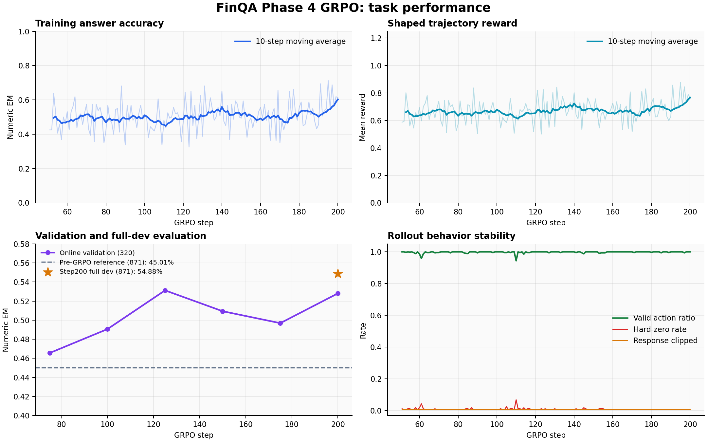
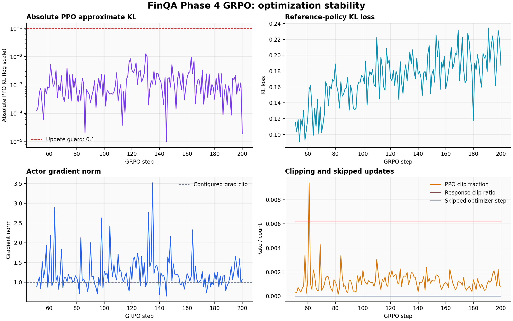

# 金融迁移 Phase 4：FinQA GRPO 稳定训练与全量评测报告

## 1. 阶段目标

本阶段在已经具备金融并行检索能力的 Qwen2.5-3B 策略上继续进行 GRPO，目标不是增加新的动作标签，而是在保持稳定交互格式的前提下提升 FinQA 数值问答准确率：

```text
<think> -> <search>q1 || q2</search>
-> 真实 retriever 回填 <information>
-> <think> -> <answer>
```

本阶段最终采用 no-plan、no-calculator 方案。模型只负责生成 reasoning、并行查询和答案；`<information>` 始终由真实金融检索器注入。

核心验收标准：

- FinQA dev Numeric EM 超过 GRPO 前的 45.01% 强基线；
- 并行 query、report-aware retrieval 和 evidence 回填链路稳定；
- 不出现伪造 `<information>`、无效 action、超轮次或格式坍塌；
- 训练后期 KL、梯度和 PPO 更新保持可控。

## 2. 模型与数据链路

### 2.1 模型来源

训练初始化模型为：

```text
FinQA SFT LoRA
-> 与 NQ Step900 并行检索模型进行 FP32 safe merge
-> 恢复 Qwen2.5-3B 的 rope_theta=1000000
-> finqa_litecoa_sft_merged_fp32_v3
```

FP32 logits 等价性检查通过。100 条 BF16 对照中，动态 LoRA 与修复后的 merged v3 均达到 44/100 Numeric EM。此前错误合并模型产生的 25%-26% 结果来自 RoPE 配置漂移，不作为本阶段有效基线。

### 2.2 数据与检索

| 项目 | 配置 |
| --- | --- |
| 训练集 | FinQA train，6,251 条 |
| 在线验证 | FinQA dev 固定 320 条 |
| 最终评测 | FinQA dev 全量 883 条，其中 871 条有可评分答案 |
| 检索范围 | 基于完整 page-level `report_id` 的报告内检索 |
| Retriever | E5 + FAISS，真实 `/retrieve` 服务 |
| Top-K | 3 |
| 每轮 query 上限 | 3 |
| Observation 上限 | 1,500 tokens |
| 最大搜索轮次 | 3 |

训练与最终 vLLM 评测使用同一 prompt、同一 report scope、同一 FinQA 数值匹配函数和相同的检索/长度参数。最终评测采用 greedy 解码；训练 rollout 采用 `temperature=1.0`，每题采样 5 条轨迹用于 GRPO 组内相对优势计算。

## 3. Reward 与稳定性约束

单条轨迹的原始奖励为：

```text
R_raw = 1.00 * answer_numeric_em
      + 0.05 * answer_present
      + 0.05 * no_generated_information
      + 0.05 * evidence_hit
      + 0.05 * valid_search
      + 0.05 * parallel_evidence_hit
```

最高原始奖励为 1.25。Numeric EM 使用 FinQA 数值等价判定，可处理百分比、小数、货币与 program executable answer 的语义等价。

以下任意条件成立时执行 hard zero，将整条轨迹奖励置为 0：

- response 达到长度上限；
- 没有合法 action；
- 出现 invalid action；
- 达到最大轮次仍未结束；
- 没有完整 `<answer>`；
- 模型自行生成 `<information>`。

检索器注入的 information 使用 state masking，不参与 actor token loss。任务 reward 之外使用参考策略 KL 约束，`kl_loss_coef=0.005`；当 PPO KL 非有限或绝对值超过 0.1 时跳过该次参数更新。

## 4. 稳定训练配置

[W&B run `q51bp5pw`](https://wandb.ai/sun19150956991-beijing-university-of-posts-and-telecommu/Finance_Agent/runs/q51bp5pw) 对应 `finqa-phase4-grpo-v3-stable`。

| 参数 | 设置 |
| --- | ---: |
| 起始 checkpoint | Phase 4 short run Step50 |
| 记录区间 | Step51-200，共 150 次更新 |
| GPU | 2 张 A800 80GB |
| Train batch | 32 个问题 |
| Samples per question | 5 |
| 每步 rollout 数 | 160 |
| Actor learning rate | `5e-7` |
| Warmup ratio | `0.285` |
| PPO mini / micro batch | 32 / 16 |
| PPO clip ratio | 0.2 |
| KL loss coefficient | 0.005 |
| Maximum PPO KL | 0.1 |
| Validation / save frequency | 25 / 25 steps |
| W&B runtime | 26,147 秒，约 7 小时 16 分钟 |

## 5. 训练曲线



任务效果曲线包含全部 150 个训练 step：

- `train/answer_em_mean` 的 10-step 均值约从 49.6% 上升到 60.3%；
- `critic/score/mean` 的 10-step 均值从约 0.661 上升到 0.767；
- 训练 batch answer EM 均值为 50.55%，Step200 为 61.25%；
- 有效 action 比例平均 99.77%，最终为 100%；
- hard-zero 比例平均 0.84%，最终为 0.625%；
- rollout finish ratio 平均 99.66%，最终为 100%。

需要注意：`critic/score/mean` 包含最高 0.25 的行为 shaping bonus，不等同于答案准确率；`train/answer_em_mean` 来自 temperature=1.0 的当前训练 batch，也不应直接与 greedy 全量评测等同。



优化过程没有出现此前实验中的突发坍塌：

- `abs(actor/ppo_kl)` 最大约 0.01255，远低于 0.1 更新保护阈值；
- `actor/kl_loss` 位于约 0.091-0.234，Step200 为 0.187；
- gradient norm 平均约 1.23，最大约 3.52，未出现非有限值；
- PPO clip fraction 平均约 0.12%；
- 150 次更新中 optimizer skipped 为 0；
- response clip ratio 保持在 0.625%，没有随训练推进恶化。

### 5.1 在线验证

在线验证使用固定 320 条 FinQA dev，结果如下：

| Step | Numeric EM | 正确数 |
| ---: | ---: | ---: |
| 75 | 46.56% | 149/320 |
| 100 | 49.06% | 157/320 |
| 125 | 53.13% | 170/320 |
| 150 | 50.94% | 163/320 |
| 175 | 49.69% | 159/320 |
| 200 | 52.81% | 169/320 |

验证分数存在正常波动，但没有持续下降或格式崩溃。Step125 是 320 条子集上的最高点；Step200 在该子集略低 0.31 个百分点，但随后 883 条完整评测取得了更高且更可靠的结果。

## 6. Step200 全量评测

评测配置：greedy、`temperature=0`、report-aware top3、information 1500 tokens、max turns 3、no plan、no calculator。

| 指标 | Step200 结果 |
| --- | ---: |
| Total | 883 |
| Scored gold | 871 |
| Numeric EM | **478/871 = 54.88%** |
| Raw EM | 192/871 = 22.04% |
| SubEM | 335/871 = 38.46% |
| Answer count | 883/883 = 100% |
| Format valid | 883/883 = 100% |
| Errors | 0 |
| Parser / agent warnings | 0 / 0 |
| Generated information | 0 |
| Max turns exceeded | 0 |

### 6.1 与迁移基线对比

| 模型 / 配置 | Numeric EM | Answer count | Warnings | Max turns |
| --- | ---: | ---: | ---: | ---: |
| Step900 原始并行检索策略，top2 | 11.83% | 881 | 2 | 0 |
| Step900 + FinQA SFT LoRA，top2 | 42.94% | 835 | 54 | 45 |
| Step900 + FinQA SFT LoRA，top3/info1500 | **45.01%** | 856 | 31 | 26 |
| **FinQA GRPO Step200，top3/info1500** | **54.88%** | **883** | **0** | **0** |

相对最强的 GRPO 前参考结果 45.01%，Step200：

- Numeric EM 提升 **9.87 个百分点**；
- 相对增幅约 **21.9%**；
- 多答对 86 条有标准答案的样本；
- answer coverage 从 96.94% 提升到 100%；
- max-turn exceeded 从 26 降到 0；
- parser + agent warnings 从 31 降到 0。

45.01% 来自动态 LoRA 的完整评测，是当前最强的 pre-GRPO reference。FP32 merged v3 已通过 logits 和 100 条 BF16 A/B 等价验证，但没有单独进行 883 条 pre-GRPO 全量评测，因此这里不把 45.01% 表述为完全相同加载形态下的严格 checkpoint A/B。

### 6.2 并行搜索行为

Step200 的 883 条轨迹全部只进行 1 次 search：

- 882 条生成 2 个并行 query；
- 1 条生成 3 个并行 query；
- 所有 `<information>` 均来自 retriever；
- 全部轨迹以完整 `<answer>` 结束。

代表性正确样本中，模型面对五年累计收益问题，分别查询初始值和最终值，检索到 `$100 -> $204` 后回答 `104%`，与 gold 和 executable answer 一致。

首条错误样本同样完成了合法双查询和证据回填，但在 sold receivables 问题上输出 `16.67%`，gold 为 `11%`。这说明剩余问题已经从“不会搜索或格式崩溃”转向“在相近财务字段中选错数值或计算口径”。

## 7. 结论

金融迁移 Phase 4 已完成并通过验收。

本阶段证明：在不增加 plan 或 calculator action 的情况下，3B 模型可以通过真实金融检索器、并行 query rollout、FinQA 数值等价 reward、hard-zero 行为约束和较强 KL 正则完成稳定 GRPO 对齐。最终模型不仅将 Numeric EM 从 45.01% 提升到 54.88%，还同时消除了回答缺失、超轮次和 parser/agent warning，没有以牺牲交互稳定性换取准确率。

Step200 固化为当前金融并行检索模型的最佳 checkpoint。下一阶段应优先分析 393 条 Numeric EM 错误样本，区分检索未命中、字段选择错误、计算口径错误和答案单位错误，再决定是否继续 GRPO 或加入受控计算工具。

## 8. 可复现材料

- 训练曲线原始导出：[`wandb_q51bp5pw_raw_history.json`](./finqa_eval/20260727/phase4_training/wandb_q51bp5pw_raw_history.json)
- 对齐后的逐步数据：[`wandb_q51bp5pw_history.csv`](./finqa_eval/20260727/phase4_training/wandb_q51bp5pw_history.csv)
- W&B 元数据：[`wandb_q51bp5pw_metadata.json`](./finqa_eval/20260727/phase4_training/wandb_q51bp5pw_metadata.json)
- Step200 summary：[`summary.json`](./finqa_eval/20260727/full_dev/phase4_step200_nocalc_topk3_info1500/summary.json)
- Step200 完整轨迹：[`trajectories.jsonl`](./finqa_eval/20260727/full_dev/phase4_step200_nocalc_topk3_info1500/trajectories.jsonl)
- Step200 评测日志：[`eval.log`](./finqa_eval/20260727/full_dev/phase4_step200_nocalc_topk3_info1500/eval.log)
